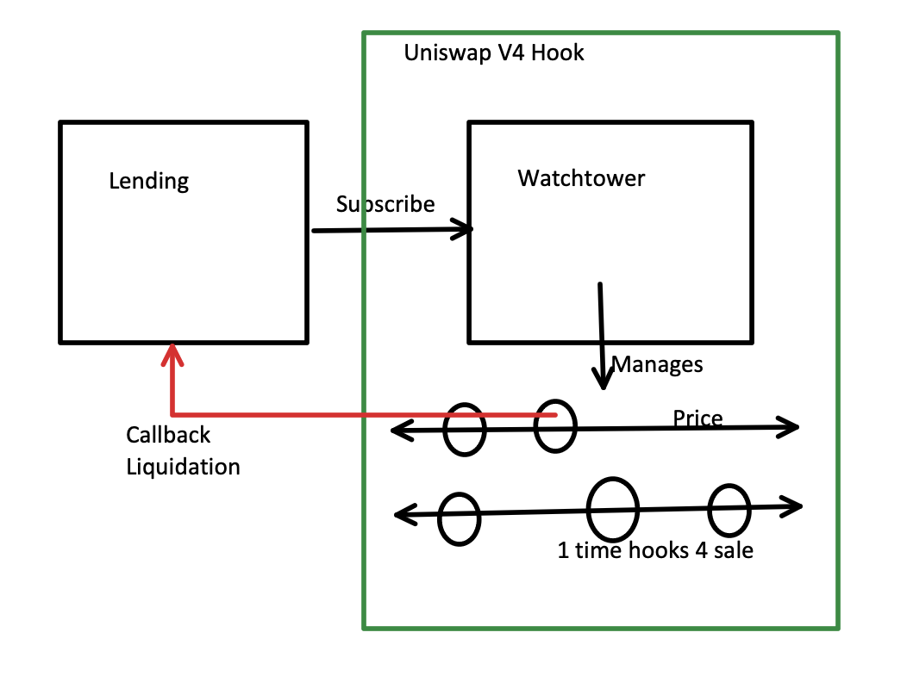

[This project, (Watchtower)](https://ethglobal.com/showcase/watchtower-d2c1o) won the following prizes at the [ETHGlobal Taipei 2025](https://ethglobal.com/events/taipei) hackathon:

🥇 [Uniswap Foundation - Uniswap v4 Hook Integrations 1st place](https://ethglobal.com/showcase/watchtower-d2c1o)

🥈 [Nodit - Best Multi-chain App with Nodit's Web3 Data API 2nd place](https://ethglobal.com/showcase/watchtower-d2c1o)


# Watchtower - One-time Hooks for Sale

The demo instructions and video are [here](./demo/README.md).

## Abstract

This is a prototype of ***Watchtower***,  a novel protocol for atomic price action triggered interventions. Uniswap V4 Hooks have allowed this protocol to
react to price changes caused by executions of swaps. The reactions are atomic first-in-line without a possibility for anyone to intercept
and front-run the reacting transaction.

Watchtower allows for anyone to permissionlessly subscribe to desired price actions caused by swaps and and take advantage of the prompt atomic actions as
desired. Such actions can be delinquent loan liquidations, limit orders, undercollateralized option and/or derivative liquidations and many other use cases.

The implementation was facilitated by our One-time Hooks, which can be attached and detached dynamically to Uniswap V4 pools.

Watchtower has an economic incentive model that is beneficial to all parties involved.

## Introduction

Traditionally, price action interventions contain the following components:
- Oracle, which provides the latest prices. This can be an off-chain Oracle, such as Chainlink, or on-chain oracle such as Uniswap Oracle (part of Uniswap V2, V3 and V4 implementations).
- Keeper, which calls Smart Contract functions in order to react to changes at the appropriate time.
- Action Code, which, when called by the Keeper, consumes the Oracle pricing, verifies that the action preconditions are met and calls the appropriate action.

This has been a problem as the Keeper has latency in reaction to events and placing on-chain call transactions. Such undesired latency issues have been mitigated
by overprotecting the target protocol, usually by asking for excessive overcollateralization in lending and leveraged protocols. This directly impacts the capital
efficiency of such protocols.

Watchtower's ability to react atomically mitigates this issue significantly.

## Atomic Actions

How does this work?

In order to act on-chain, someone needs to initiate the contract call. This is not done by keepers, but by `swap` callers on Uniswap V4. Unknowingly they can cause action trigger calls, which does not cost them anything and they are 
rewarded for this as well. The user simply visits the Web3 front end of Uniswap V4. As soon as they ask for a swap,
the Uniswap V4 calculates a route for the most efficient execution of the swap. Multiple pools can be used, but almost no pool is left behind, as if that happens, the pool in question remains behind with a more favorable price and it becomes even more attractive.  

This is achieved via an Uniswap V4 Hook, attached to one of the above described pools. This hook can be used by multiple pools, as many as one would want. However this hook is quite complicated. As Uniswap V4 hooks are permanently attached to the pools, this hook:
- Manages a data structure of registered Watch-ers ("hooks for sale"; not Uniswap hooks). These Watch-ers can execute one-time, pay
for this to both the swapper and the pool and drop off.
- As the price moves, it performs the proper calculation to efficiently trigger the appropriate Watch-ers in constant time ($O(1)$).
- Cleans up to avoid storage cost and get storage refunds.



## Use Cases

The Watchtower atomic actions can be used to:
- Secure lending protocols and pools.
- Secure leveraged options and derivative protocols and pools.
- Execute limit orders.
- Execute sniping of purchases of Real World Tokenized Assets. 

## Economic Incentives - Everyone is Happy

In order for the Watchtower protocol to be used, everyone has to have economic interest:
- The swapper gets rewarded.
- The pool gets rewarded.
If for example, the Watchtower is used to protect a lending protocol, as in our example implementation:
- The borrower is happy - they are asked for less collateral (cost of capital).
- The lender is happy - they deploy more loans with less risk and make more profit (capital efficiency).
- The liquidator is happy to receive liquidation rewards, ***without active participation***. This liquidator can be the lender themselves or the lending protocol.

## Implementation

### Watchtower

The Watchtower is implemented as an Uniswap V4 Hook.
It handles all necessary bookkeeping in order to:
- Allow interested parties to deposit rewards for the
swap caller and the corresponding pool.
- Allow callbacks to be executed.
- Clean-up after one-time execution of the callbacks
and reward dissemination.
- Executes assertions to assure the caller that no
funds are lost.

It can be tested using:
```zsh
forge test Watchtower.t.sol
```
This test contains the entire workflow of 
- lending (see below), 
- registering delinquency protection
callback, and
- performing the liquidation

This test script (`Watchtower.t.sol`) can be used as sample code for instantiating Uniswap V4 pools that contain the Watchtower Hook.

### WatchList

The WatchList is a contract which implements an efficient data structure for managing the callbacks as the price
changes:
- Each Uniswap V4 Pool contains two lists. Pool in Uniswap V4 is a data structure and not a contract, as Uniswap V4 handles all pools in a single contract:
    - One list for capturing downward price actions.
    - One list for capturing upward price actions.

These lists are doubly linked via Solidity mappings.
In addition elements are accessed directly via a third mapping.

The last price is remembered for the pool and compared to the latest `afterSwap` price. Then all entries are swept between the two prices and:
- Each entry's callback is executed.
- The `swap` caller is paid their reward.
- The pool is rewarded via `donate`.
- The entry is removed and the list is relinked to patch the gap.

In addition, insertion into the list takes $O(1)$ time, as the caller can discover the proper insertion
location and pass a "hint" to the insertion call with
the right location, to be patched in in constant time.


The operation can be tested using:
```zsh
forge test WatchList.t.sol
```

### Lending Liquidation Demo

I implemented a simple Lending protocol, with configurable parameters for the following parameters:
- Initial Collateralization Ratio
- Minimum Collateralization Ratio (to avoid liquidation)
- Liquidation Penalty Ratio
- Interest Rate (per block)

The contract `LoanPairFactory` creates a Lending Pool
for a given pair of ERC20 tokens. The Lending Pool is implemented in the contract `LoanPair`:
- Lenders call `deposit` and/or `withdraw` to manage their deploy capital. 
- Borrowers call `borrow` and/or `repay` to manage their loan.
- Liquidators call `liquidate` to overtake delinquent loans and get rewarded for it.

This lending protocol can be tested using:
```zsh
forge test Loan.t.sol
```
